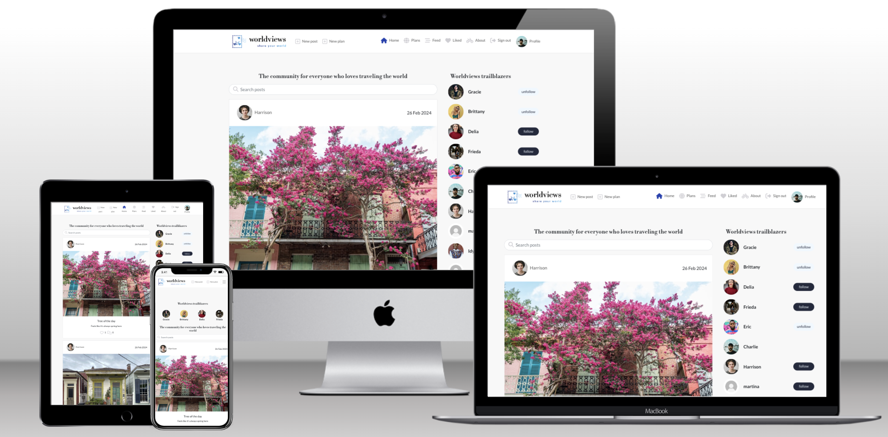

# Worldviews

  

Worldviews is a community web app for everyone who loves traveling the world. It's a place to share your unique views, within a kind and curious community.
 
This website is responsive on all devices, and designed to be appealing and intuitive. Users can:
- Create a profile
- Follow other users
- Post/edit/delete images and content from their travels
- Post/edit/delete their travel plans
- Search posts and plans
- View all the posts and plans of others
- Like and comment on posts and plans

All user-generated content has full CRUD functionality. The live site can be visited [here](https://worldviews-162453e10c7f.herokuapp.com/).

## Table of Contents
- [Intro](#worldviews)
- [Table of Contents](#table-of-contents)
- [UX](#ux)
  - [User Personas](#user-personas)
  - [User Stories](#user-stories)
  - [Structure](#structure)
  - [Features](#features)
  - [Surface](#surface)
- [Testing](#testing)
- [Future Implementations](#future-implementations)
- [Languages, Libraries, and Software](#languages-libraries-and-software)
- [Deployment](#deployment)
- [Credits](#credits)

## UX
### User Personas
- A world traveler who loves to take and share photos
- An organized traveler looking for inspiration
- A sociable traveler making plans to meet up with others
- A travel-curious daydreamer

### User Stories
These stories guided the development of features. To implement Agile methodology, they were mapped to Github Projects in a [kanban board](https://github.com/users/emilyrosenberg/projects/7/views/1) along with other development tasks. They are grouped into Milestones and tagged with priority labels.

#### Navigation & Authentication (from walkthrough)
- Navigation: As a user I can view a navbar from every page so that I can navigate easily between pages
- Routing: As a user I can navigate through pages quickly so that I can view content seamlessly without page refresh
- Authentication - Sign up: As a user I can create a new account so that I can access all the features for signed up users
- Authentication - Sign in: As a user I can sign in to the app so that I can access functionality for logged in users
- Authentication - Logged in Status: As a user I can tell if I am logged in or not so that I can log in if I need to
- Authentication - Refreshing access tokens: As a user I can maintain my logged-in status until I choose to log out so that my user experience is not compromised
- Navigation: Conditional rendering - As a logged out user I can see sign in and sign up options so that I can sign in/sign up
- Avatar: As a user I can view user's avatars so that I can easily identify users of the application

#### Adding & Liking Posts (from walkthrough)
- Create posts: As a logged in user I can create posts so that I can share my images with the world!
- View a post: As a user I can view the details of a single post so that I can learn more about it
- Like a post: As a logged in user I can like a post so that I can show my support for the posts that interest me

#### The Posts Page (from walkthrough)
- View most recent posts: As a user I can view all the most recent posts, ordered by most recently created first so that I am up to date with the newest content
- Keyword search: As a user, I can search for posts with keywords, so that I can find the posts and user profiles I am most interested in.
- View liked posts: As a logged in user I can view the posts I liked so that I can find the posts I enjoy the most
- View posts of followed users: As a logged in user I can view content filtered by users I follow so that I can keep up to date with what they are posting about
- Infinite scroll: As a user I can keep scrolling through the images on the site, that are loaded for me automatically so that I don't have to click on "next page" etc

#### The Post Page (from walkthrough)
- Post page: As a user I can view the posts page so that I can read the comments about the post
- Edit post: As a post owner I can edit my post title and description so that I can make corrections or update my post after it was created
- Create a comment: As a logged in user I can add comments to a post so that I can share my thoughts about the post
- Comment date: As a user I can see how long ago a comment was made so that I know how old a comment is
- View comments: As a user I can read comments on posts so that I can read what other users think about the posts
- Delete comments: As an owner of a comment I can delete my comment so that I can control removal of my comment from the application
- Edit a comment: As an owner of a comment I can edit my comment so that I can fix or update my existing comment

#### The Profile Page (from walkthrough)
- Profile page: As a user I can view other users profiles so that I can see their posts and learn more about them
- Most followed profiles: As a user I can see a list of the most followed profiles so that I can see which profiles are popular
- User profile - user stats: As a user I can view statistics about a specific user: bio, number of posts, follows and users followed so that I can learn more about them
- Follow/Unfollow a user: As a logged in user I can follow and unfollow other users so that I can see and remove posts by specific users in my posts feed
- View all posts by a specific user: As a user I can view all the posts by a specific user so that I can catch up on their latest posts, or decide I want to follow them
- Edit profile: As a logged in user I can edit my profile so that I can change my profile picture and bio
- Update username and password: As a logged in user I can update my username and password so that I can change my display name and keep my profile secure

#### Locations model (connected to Plans)
- Locations search: As a user I can search post locations so that I can see posts about a specific location
- See future implementations, [below](#future-implementations), for more features.

#### Plans model (inspired by [Pet Palace](https://github.com/Ajn0r/pet-palace) Ads model)
- Create plan: As a logged-in user I can create a plan so that I can ask other users for info about a location
- Manage plan: As a logged-in user I can edit or delete my own plans so that I can make corrections or update my request
- View plans: As a user I can view plans that other users have made so that I can see if there are any interesting ones
- Search: As a user I can search plans so that I can find past recommendations
- Create plans comments: As a logged-in user I can comment on a plan so that I can share info with other users
- Manage plan comments: As a logged-in user I can edit or delete my own comments so that I can control my contributions

### Structure
#### Landing Page
The landing page welcomes a new user to Worldviews with a short description of the community, all the user posts on the site, and a list of the most popular travelers. They can view the content, and have the option to sign up.

**Account Creation**  
The user can create an account with a username and password. This functionality comes from allauth. They can then log in, log out, create, update, and delete posts and plans, like and unlike posts and plans, and follow and unfollow other users.
- Create an account: This is a simple form to create a username and password.
- Sign in: This is a simple form to enter username/password.
- Sign out: Click on the Sign out button to sign out.

**Posts**  
All posts are visible on the landing page. Users can search posts by keyword. When a user creates an account and signs in, they can filter the posts that they have liked on the Likes page, and the posts of users they have followed on the Feed page.

**Post CRUD:**  
A logged-in user can:
- Create a new post
- Read posts
- Update their own posts
- Delete their own posts
- Comment on posts and edit/delete their comments

**Plans**  
All plans are visible on the plans page. Users can search plans by keyword.

**Plans CRUD:**  
A logged-in user can:
- Create a new plan
- Read plans
- Update their own plans
- Delete their own plans
- Comment on plans and edit/delete their comments

**Like:**  
A logged-in user can:
- Like a post or plan
- View their liked posts and plans on the Likes page
- Unlike a post or plan

**Follow:**  
A logged-in user can:
- Follow another user
- View their followed users' posts in their Feed
- Unfollow a user

**Other Pages:**  
#### About
The About page is all about the Worldviews community and mission. Users can find out about new features that are in development. In the future they will be able to send feedback.

#### 404
A custom 404 page appears when the user navigates to a page that doesn't exist.

### Features
#### Header and Navigation
The header includes the Worldviews logo, navigation items, and Sign in/Sign out buttons.
- The logo is described [below](#logo).
- The navbar always contains Home and About. If the user is logged out or has no account, they can see options to Sign Up and Sign In. If the user is logged in, they can see the Plans, Feed, Liked, and Sign out options, and their profile avatar.

#### Search bar
- The search bar has an input field and a button. User can search by keyword and results will be returned if the keyword matches any posts's title, content, or author.

### Features

#### Reusable components
This web app incorporates reuseable React components to streamline complexity so that each component's code is written only once, and to improve UX by creating a predictable experience across the web app. For instance, every time a user wants to edit or delete their own user-generated content of any kind, the process is the same.
- Navbar: The navbar appears on every page.
- Avatar: This is the user's profile image, and is used as a link to their profile everywhere on the web app.
- Asset: This is an animated spinner that shows whenever a component is loading.
- More dropdown for editing and deleting: This dropdown menu is used to edit or delete a user's own content in posts, plans, and comments.
- Dropdown list for locations: This dropdown menu contains all the locations and is used for plans. In the future it will be used for posts as well, and to filter the locations page.

#### Profiles
- Profile creation: Users can create a profile with an image, name, and bio.
- Profile page: Profiles show all the user's posts, and counts of how many posts and followers they have, as well as how many other users they follow.
- Users can follow or unfollow each other from one another's profile page.

#### Most popular profiles
- The list of most popular profiles appears as a sidebar on larger screens and below the navbar on smaller screens.
- The users with the most followers appear at the top.

#### Posts
- Each post has a large image uploaded by the user, a title, and content.
- All the posts appear on the home page, most recent first.
- Post search: There is a search bar for finding posts by keyword. If the word is in any part of the post, it will be filtered by the search. If not, the user will see a  no-results message.  

For logged-in users
- Add post form: The user can access this form in the navbar. It allows them to add a post and includes input fields for title, content, and an image.
- Update post form: This form is accessed through the dropdown menu on a user's post. They see the same form with their post information, and can make updates in any field.
- Delete post: The user can access this function through the dropdown menu on their post, and delete the post.
- Comments: Users can comment on one another's posts. Comments have full CRUD functionality.
- Feed: All posts by followed users appear in the feed.
- Likes: Users can like and unlike one another's posts. All posts a user has liked will appear on the Likes page.

Note: The post content was created with popular locations in mind, so that the locations model can be implemented and tested more easily in the future:

  

#### Plans
- Each plan has a location, a title, and content.
- Plan search: There is a search bar for finding plans by keyword. If the word is in any part of the plan, it will be filtered by the search. If not, the user will see a  no-results message.
- Add plan form: The user can access this form in the navbar. It allows them to add a plan and includes input fields for title, content, and location.
- Update plan form: This form is accessed through the dropdown menu on a user's plan. They see the same form with their plan information, and can make updates in any field.
- Delete plan: The user can access this function through the dropdown menu on their plan, and delete the plan.
- Comments: Users can comment on one another's plans to share advice about future travel. Comments have full CRUD functionality.

#### Locations
- Users can choose a location for their plan from a dropdown menu of the most popular destinations.
- In the future users will be able to add custom locations, and see all locations on a locations page.

#### About
- Users can read all about Worldviews. In the future there will be a contact form.

### Surface
#### Colors
The color palette is from the Moments walkthrough project. It is a clean white and blue, with some gray, and lets the images shine. In order to create a minimum viable product, I designed the logo in the same palette with a dynamic mix of purple and blue. In the future Worldviews will have a more sophisticated color palette based on these colors.

These colors are currently used on the site:
- White: #ffffff
- Off white: #f0f1f9
- Black: #000000
- Light gray: #cfced3
- Medium gray: #7177a1
- Gray: #242a3d
- Blue: #2142b2
- Purple: #535da4
- Red: #f85032

#### Fonts
The fonts used in this project are implemented as a url from [Google Fonts](https://fonts.google.com/). I generated suggestions for matching the logo fonts with [Matcherator](https://www.fontspring.com/matcherator).  
The title font is [Libre Bodoni](https://fonts.google.com/specimen/Libre+Bodoni). The logo has a similar font, and I decided to use it for the titles. It has a worn-in, analog style that suits the branding.

  

The main font is [Lato](https://fonts.google.com/specimen/Lato). This is a modern, readable sans serif font. It gives clarity to the content.

  

#### Logo
The logo represents the Worldviews community's love of travel. Each person on earth has a unique perspective depending on their background, travel style, means of transport - maybe a bicycle! This is the place to share all these wonderful views with the world, within a kind and curious community.
 
The logo was made with [Looka](https://looka.com/).  

  

#### Favicon
The favicon was created from the logo image using the [favico.io favicon converter](https://favicon.io/favicon-converter/).  

  

#### Images
The Sign in and Sign up images are from [Unsplash](https://unsplash.com/). They were chosen to represent the beginning of a journey, with some of the blue color that is present in the rest of the design.  
All of the post and profile images are also from [Unsplash](https://unsplash.com/).
 
The images are stored in and accessed through [Cloudinary](https://cloudinary.com).

#### Wireframes
The layout and design is based on the Moments walkthrough project.

  

  

  

  

  

Posts and plans are currently designed like this:

  

Posts and plans will become more useful with future expansion of the locations model and a feature for adding travel dates to plans:

  

#### Screenshots
<!-- The website looks like this -->

## Testing
#### Lighthouse
### Code Validation
#### HTML
#### CSS
#### Javascript
#### Python
### User Stories Testing
### Manual Testing
This web app was tested in Chrome Developer Tools for troubleshooting functionality and style problems during development. It was tested on iOS with Chrome and Safari.
### Bugs
- Unable to deploy backend or update Config Vars 
  - Tried [this](https://stackoverflow.com/questions/71076368/unable-to-add-update-config-variables-in-heroku) but it did not work
  - Got help from tutoring, commented out CLIENT_ORIGIN_DEV in settings.py
  - Created a new Heroku app for the API
  - Added the correct Config Vars including CLIENT_ORIGIN_DEV
  - Was then not able to connect frontend and backend
- Unable to connect frontend and backend
  - Axios 404 error
  - Got help from tutoring, uncommented CLIENT_ORIGIN_DEV in settings.py and was able to deploy the API
  - Changed the CLIENT_ORIGIN_DEV var to the Gitpod workspace instead
  - Frontend and backend then connected
  - Tested by creating a new post in the frontend, which showed in the backend with an ID of 1
  - Previous posts from the API were not visible, and we do not know why this is
- Submit button not working in plans
  - I tried to recreate the Posts views to make the Plans views, but the form wasn't working
  - I got this error in the console: 
    TypeError: _ api_axiosDefaults__WEBPACK_IMPORTED_MODULE_4__.axiosReq.plan is not a function
  - I read [this guidance on Stack Overflow](https://stackoverflow.com/questions/55092281/axios-webpack-imported-module-0-default-amethod-is-not-a-function) and realized that when I changed "post" to "plan" everywhere, of course that also affected the post method. Oops.
  - I changed the code back to `axiosReq.post` and was able to submit the form.
- Plan edit not working from the more dropdown menu
  - Instead of the page for that individual plan, something that looked like the plan create page was loading.
  - I checked the link in the Plans.js page
  - I realized that I had typed `$(id)` instead of `${id}`
  - I fixed the typo and it worked perfectly
- Database not connecting properly
  - In the deployed version of the Django admin panel I could see the correct content, but on the server I only had content that I had made at the beginning of the project in Django admin.
  - Tutoring helped me figure out that the backend was still connected to sqlite.
  - In settings.py I changed DEV to DEV_DB, and the correct content was visible on the server.
  - I also needed to migrate social and social accounts to the correct database.
- Models not showing up in Django admin
  - I found the answer [here](https://stackoverflow.com/questions/2984987/model-not-showing-up-in-django-admin) and registered the models.
- Search bar for Plans not working
  - The spinner was visible but no results appeared
  - There was a server (500) error
  - I cleared the cache and double-checked the tutorial against the Posts search bar.
  - Tutoring another error that showed "iconstant" but this appeared nowhere in any code.
  - It turned out to be a problem in the backend: in plans/views.py search_fields, `location` needed to be changed to `location__name` in order to find the results in the locations model.
  - This fixed the problem.
  - Tutoring also suggested that I add currentUser to PlansPage.js as it is in PostsPage.js, and I did this and left it in the code although I think it might not be necessary.

## Future Implementations
- Improved navigation: The user will be able to see the most important links, and have a less-cluttered navigation option for finding other information.
- Feedback messages: Users will get a feedback popup when engaging with features on the site.
- Contact form: The user will be able to fill out and submit a contact form.
- Surface: Update styling, branding, and visual appeal.
- Popular locations: The user will be able to see the most popular locations for posts, so that they know where other users are traveling and posting.
- Locations page: Users can view all post locations so that they can get inspiration about locations
- Plan dates: Users will be able to add travel dates to their plans.
- Messaging: Users will be able to direct-message each other as well as communicating through comments.
- Custom locations: Users will be able to add custom locations instead of choosing from the dropdown.
- View plans and posts by location: Users will be able to use filters to see all content about a given location.
- Locations map: Users will be able to see all the locations on a map.
- Improved search: Search function will include more of the fields in posts and plans, for instance content as well as title, location, etc.

## Languages, Libraries, and Software
### Languages
- HTML
- CSS
- Javascript
- Python
### Modules and Packages
<!-- - black (python formatter)
- cloudinary (image hosting)
- crispy-bootstrap5
- dj-database-url
- django-allauth (authorization package)
- django-cloudinary-storage
- django-resized (resizes a photo submitted in the form)
- django-richtextfield (allows markdown styling in input fields)
- gunicorn (server for WSGI applications)
- psycopg2
- whitenoise (allows static files to load in deployed app) -->

- axios
- bootstrap
- jwt-decode
- react
- react-bootstrap
- react-dom
- react-infinite-scroll-component
- react-router-dom
- react-scripts
- web-vitals
- react-app
- react-app/jest
- msw
- node
- npm

### Frameworks and Websites
- Bootstrap4
- Django
- Github
- Github projects [Kanban board here](https://github.com/users/emilyrosenberg/projects/7/views/1)
- Cloudinary
- PostgreSQL (ElephantSQL)
- Heroku
- VS Code
- Google Chrome Dev Tools
- Google Fonts
- Matcherator
- Color Picker
- Unsplash
- PEP8
- W3C - HTML
- W3C - CSS

## Creating the App
### Creating the Repo and Local Workspace
This app was created with Gitpod and developed in VS Code.
1. Go to the Code Institute React CI Template [Template](https://github.com/Code-Institute-Org/react-ci-template)
2. Click on Use This Template
3. Create a new repository with the template, and copy the url
Open VS Code and click Clone Git Repository and enter the url
4. Save the repository locally
5. Open a new terminal
6. Run `python3 -m venv .venv` and `source .venv/bin/activate` to create and activate the virtual environment
7. Run `npm install`
8. Run `npm audit fix --force` to fix errors
9. Run `npm start` to run the app locally

<!-- 
6. Install Django and gunicorn: `pip3 install django gunicorn`
7. Install supporting database libraries dj_database_url and psycopg2 library: `pip3 install dj_database_url psycopg2`
8. Create file for requirements: in the terminal window type `pip freeze --local > requirements.txt`
9. Create project: in the terminal window type `django-admin startproject <your_project_name>`
10. Create app: in the terminal window type `python3 manage.py startapp <your_app_name>`
11. Add app to the list of installed apps in settings.py file: your_app_name
12. Migrate changes: in the terminal window type python3 manage.py migrate
13. Run the server to test if the app is installed, in the terminal window type `python3 manage.py runserver`
14. If the app has been installed correctly the window will display The install worked successfully! Congratulations! 
Additional instructions:
15. Create an account in ElephantSQL as a PostgreSQL database and connect in Heroku config vars and env.py
16. Create an account in Cloudinary for image storage and connect in Heroku config vars and settings.py -->

<!-- _Thanks to [Pedro Cristo](https://github.com/PedroCristo/portfolio_project_4/blob/main/README.md?plain=1) for the basis for these app creation instructions._ -->

## Deployment
The web app was deployed with Heroku. It is live at this [link](https://worldviews-162453e10c7f.herokuapp.com/).  

### Heroku deployment
This site was deployed by completing the following steps:

1. Log in to [Heroku](https://id.heroku.com) or create an account
2. On the main page click the button labeled New in the top right corner and from the drop-down menu select Create New App
3. You must enter a unique app name
4. Select your region
5. Click on the Create App button
6. Click Resources and select Heroku Postgres database
7. Open the Settings tab and scroll down to Config Vars
<!-- 8. Click Reveal Config Vars and add a new record with `SECRET_KEY = <key>`
9. Add a new record `CLOUDINARY_URL = <url>`
10. Add a new record `DISABLE_COLLECTSTATIC = 1`
11. Next, scroll down to the Buildpack section click Add Buildpack. Select Python and click Save Changes
12. Open the Deploy tab
13. Select Github as the deployment method
14. Confirm you want to connect to GitHub
15. Search for the repository name and click the connect button
16. Scroll to the bottom of the deploy page and select the preferred deployment type. Enable Automatic Deploys for automatic deployment when you push updates to Github
17. Create a Procfile `web: gunicorn <your_project_name>.wsgi`
For final deployment:
_NOTE: I could not deploy this way, unfortunately. A CI tutor told me that in order to deploy, I must have DEBUG = True in settings.py and DEBUG = FALSE in Heroku. A fellow student thought it might be a problem with the static files. I ran `python3 manage.py collectstatic` but this did not help either. Another CI tutor did troubleshooting with me and found a database error because Django is finding an earlier version of the database. I cannot recreate the error locally. When I try to run locally, I get Server Error (500). In settings.py DEBUG = False, and the app is running on Heroku. For now, this is the best I could do before submission. Actually finally it was no longer deploying from Heroku and so that the assessors can at least see my project, I set everything back to the way it was before. DEBUG = True in settings.py and DEBUG = FALSE in config vars._
18. When development is complete change the debug setting to: `DEBUG = False` in settings.py
19. In Heroku settings, delete the config vars for `DISABLE_COLLECTSTATIC = 1`, and `DEBUG = FALSE`

_Thanks to [Pedro Cristo](https://github.com/PedroCristo/portfolio_project_4/blob/main/README.md?plain=1) for the basis for these deployment instructions._ -->

## Credits
### Content
- The list of most-visited cities is from Google.
- Other content is either from the Moments walkthrough or original.
### Media
- The profile images and post images are from [Unsplash](https://unsplash.com/).
### Thank you
- This project was developed using the Code Institute Moments walkthrough and Django REST Framework walkthrough. I used these tutorials as inspiration for the entire project.
- The project was also inspired by 
[Ronja Sjögren's Pet Palace PP5 project](https://github.com/Ajn0r/pet-palace).
- More inspo came from [Sandra Bergstrom's Travel Tickr](https://github.com/SandraBergstrom/travel-tickr).
- Inspiration for this readme came from [gStarhigh](https://github.com/gStarhigh/pro4).
- An outline of the deployment instructions came from [Pedro Cristo](https://github.com/PedroCristo/portfolio_project_4/blob/main/README.md#frameworks---libraries---programs-used).
- Thank you to the Code Institute tutors for their enthusiastic support with problem solving and squashing bugs.
- Thank you to my Code Institute mentor, Martina Terlevic.
- Thanks to my Code Institute cohort facilitator Kristyna, who is the best at pep talks.
- And last but not least, thank you to my amazing student pals who have banded together to provide positivity and solutions in the tough times, and celebrations in the good ones.